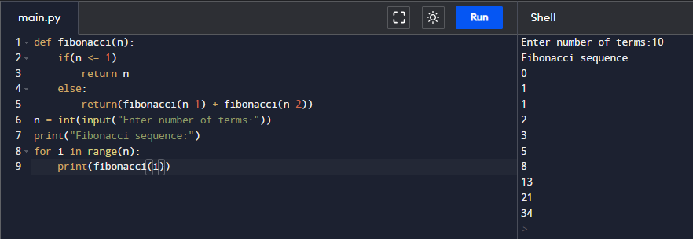

# Assignment - 22 Full Stack Web Development using Python MySirG More on Recursion

    Qns 1. Write a recursive python function to calculate sum of first N natural numbers.

    Ans.

    Qns 2. Write a recursive python function to calculate sum of first N odd natural numbers.

    Ans.

    Qns 3. Write a recursive python function to calculate sum of first N even natural numbers.

    Ans.

    Qns 4. Write a recursive python function to calculate sum of squares of first N natural numbers.

    Ans.

    Qns 5. Write a recursive python function to calculate sum of cubes of first N natural numbers.

    Ans.

    Qns 6. Write a recursive python function to calculate the factorial of a number.

    Ans.

    Qns 7. Write a recursive python function to calculate sum of the digits of a given number.

    Ans. 

    Qns 8. Write a recursive python function to print binary of a given decimal number.

    Ans.

    Qns 9. Write a recursive python function to print octal of a given decimal number.

    Ans.

    Qns 10. Write a recursive python function to find the Nth term of the Fibonacci series.

    Ans.
